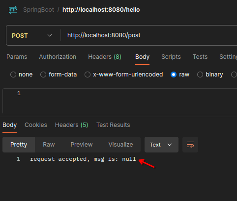
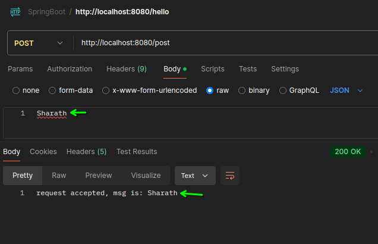

# Post mapping



to avoid above error do this:

 add `@RequestBody`

first controller.java 
```java
@PostMapping("/post")
public String makePost( @RequestBody String msg){
    return "request accepted, msg is: "+msg     ;
}
```



please note that, if you pass json object, like

```json
{
  "msg": "Sharath"
}
```
as of now it will print the same as **json object as string**

      

