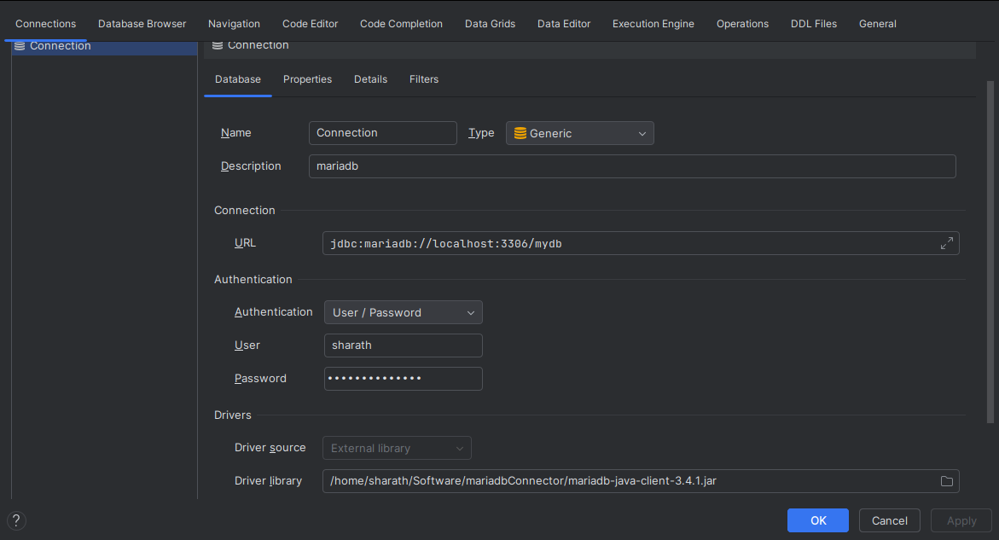

# Database start

goto market place and install database navigator

then do this, DO NOT FORGET TO ADD jdbc driver as external dependencies

to dothe above step: 

file -> project structure -> select modules -> click dependencies tab -> click on + -> add the necessary jar -> apply and save

then do this:

- update pom.xml with string jpa and mariadb driver
- create Student.java 
- rename `application.properties` to `application.yml` and add changes
- run the code