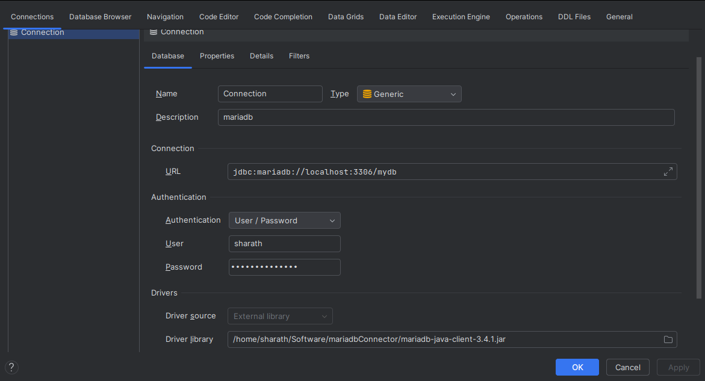

# Database start

goto market place and install database navigator

then do this, DO NOT FORGET TO ADD jdbc driver as external dependencies

to dothe above step: 

file -> project structure -> select modules -> click dependencies tab -> click on + -> add the necessary jar -> apply and save

then do this:       



- update pom.xml with string jpa and mariadb driver
- create Student.java 
- rename `application.properties` to `application.yml` and add changes
- run the code

## Changing Database name:

``` java
@Entity
@Table(name = "StudentDemo")
public class Student {
    @Id
    private Integer id;

    private String firstname;
    private String lastname;
    private String email;
    private int age;
    
    // ...
```

run the program and check the database table

after adding `@GenerateValue`  you see the log something like this:

``` 
Hibernate:
create sequence student_demo_seq start with 1 increment by 50 nocache
Hibernate:
create table student_demo (
age integer not null,
id integer not null,
fname varchar(50),
demoname varchar(255),
email varchar(255),
lastname varchar(255),
primary key (id)
) engine=InnoDB
```


