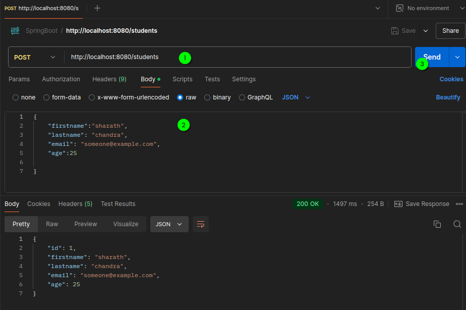
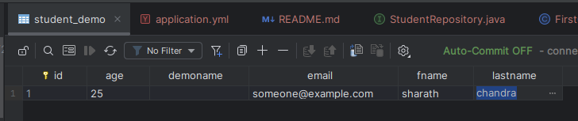

# Inserting Data into table
1. create interface `StudentRepository`

``` java
public interface StudentRepository extends JpaRepository<Student, Integer> {
}
```
2. in `FirstController`

``` java
public class FirstController {

    private final StudentRepository repository;

    public FirstController(StudentRepository repository) {
        this.repository = repository;
    }


    @PostMapping("/students")
    public Student makePost( @RequestBody Student student){
        return repository.save(student);
    }

}   
```

3. in postman do this:



4. this will insert the data.



