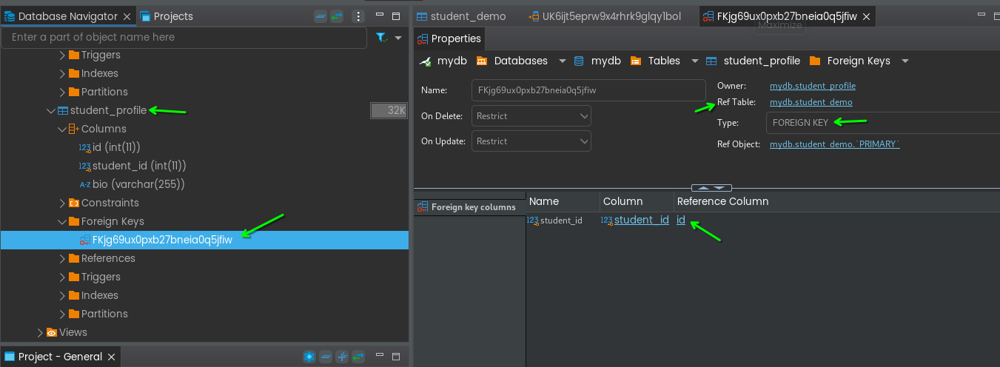
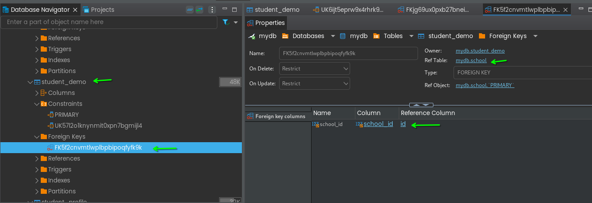

# Working on Entities and Relations ship

points to remember:
1. student have one school
2. student have one student profile
2. school can have many students


School(1) <------>(*)Student(1)<------->(1)StudentProfile

- `*` many
- `1` one relation

`CascadeType.ALL` meaning, if i delete Student then its able delete student profile also.

log will looks something like this. please read:

``` 
Hibernate: 
    alter table if exists student_demo 
       drop 
       foreign key if exists FK5f2cnvmtlwplbpbipoqfyfk9k
Hibernate: 
    alter table if exists student_profile 
       drop 
       foreign key if exists FKjg69ux0pxb27bneia0q5jfiw
Hibernate: 
    drop table if exists school
Hibernate: 
    drop table if exists student_demo
Hibernate: 
    drop table if exists student_profile
Hibernate: 
    drop sequence school_seq
Hibernate: 
    drop sequence student_demo_seq
Hibernate: 
    drop sequence student_profile_seq
Hibernate: 
    create sequence school_seq start with 1 increment by 50 nocache
Hibernate: 
    create sequence student_demo_seq start with 1 increment by 50 nocache
Hibernate: 
    create sequence student_profile_seq start with 1 increment by 50 nocache
Hibernate: 
    create table school (
        id integer not null,
        name varchar(255),
        primary key (id)
    ) engine=InnoDB
Hibernate: 
    create table student_demo (
        age integer not null,
        id integer not null,
        school_id integer,
        fname varchar(50),
        email varchar(255),
        lastname varchar(255),
        primary key (id)
    ) engine=InnoDB
Hibernate: 
    create table student_profile (
        id integer not null,
        student_id integer,
        bio varchar(255),
        primary key (id)
    ) engine=InnoDB
Hibernate: 
    alter table if exists student_demo 
       add constraint UK57l2o1knynmit0xpn7bgmijl4 unique (email)
Hibernate: 
    alter table if exists student_profile 
       add constraint UK6ijt5eprw9x4rhrk9glqy1bol unique (student_id)
Hibernate: 
    alter table if exists student_demo 
       add constraint FK5f2cnvmtlwplbpbipoqfyfk9k 
       foreign key (school_id) 
       references school (id)
Hibernate: 
    alter table if exists student_profile 
       add constraint FKjg69ux0pxb27bneia0q5jfiw 
       foreign key (student_id) 
       references student_demo (id)
```

you can check the same in dbeaver:



update Check:




## ER Diagram

right click on table -> view Diagram


