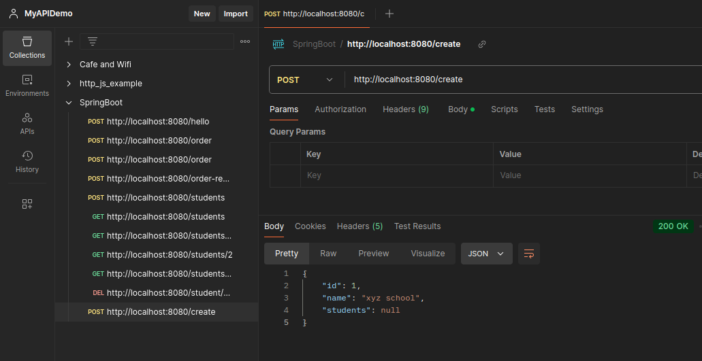
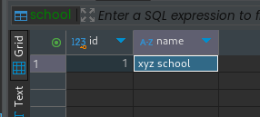
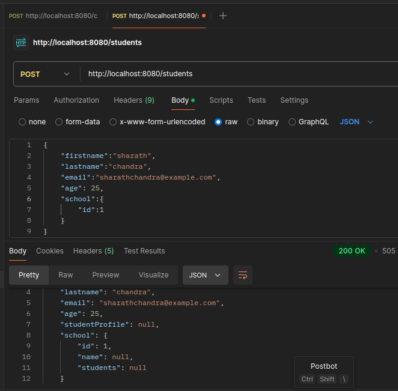
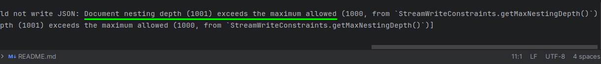
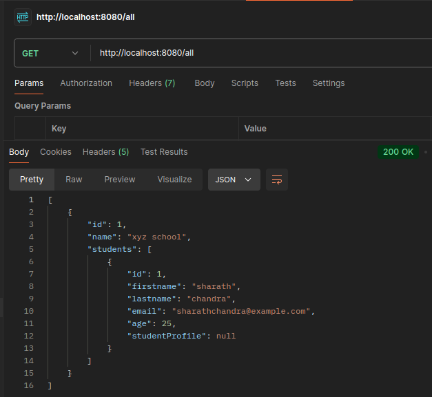

## Adding Data to Students and School

here `students` is null because we have not created yet







when we try to access http://localhost:8080/all in postman which creates infinite loop



to **avoid** the above **error, do the following**

## add this in `school.java` (parent):

``` java
@JsonManagedReference
private List<Student> students;
```
### also modify 

add `@JsonBackReference` in student.java

``` java
    @ManyToOne
    @JoinColumn(name = "school_id")
    @JsonBackReference
    private School school;
```
now there is no infinite loop:



also add more students to same school id


