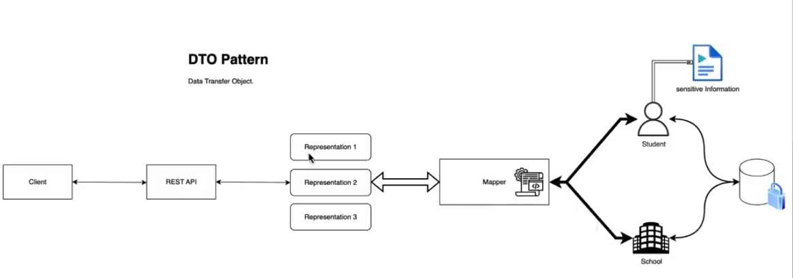
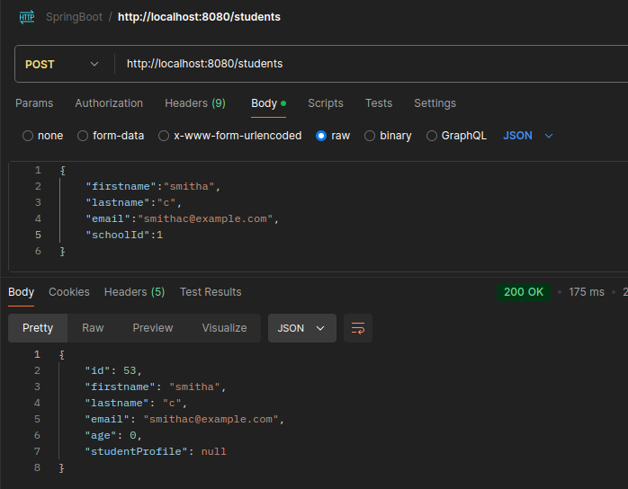
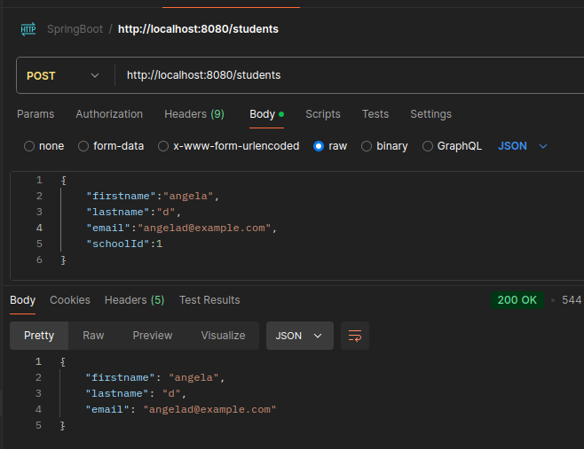
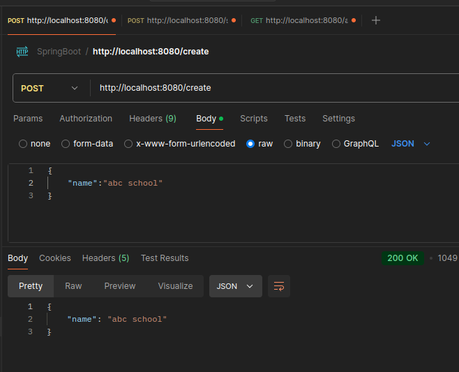
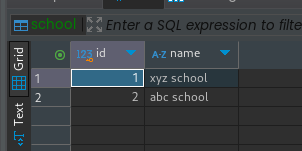
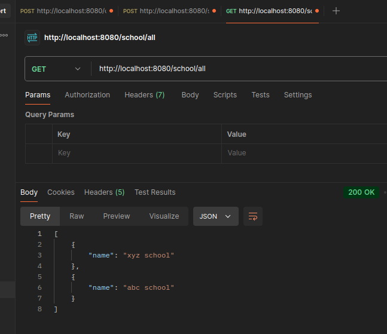

## ❗ DTO (Data Transfer Objects)

DTOs or Data Transfer Objects are objects that carry data between processes in order to reduce the number of methods calls.

- to reduce roundtrips to the server by batching up multiple parameters in a single call. This reduces the network overhead in such remote operations.
- Another benefit is the encapsulation of the serialization’s logic (the mechanism that translates the object structure and data to a specific format that can be stored and transferred).
- can hide sensitive information
- abstraction
- data separation

 

see the difference from previous example:



if we see in post man, we are still exposing age field

so, now modify the code in `studentResponseDto.java` and `StudentController.java`

see the difference:



## in School, showing only necessary things.

- add code in `SchoolDto` record
- modify the `School` class



in table:



in `SchoolController` class, do this:

``` java
    private SchoolDto toSchoolDto(School school){
        return  new SchoolDto(school.getName());
    }

    @GetMapping("/all")
    public List<SchoolDto> getAll(){
        return schoolRepository.findAll().stream().map(this::toSchoolDto).collect(Collectors.toList());
    }
```
now we dont share un necessary stuff of the school. see below




