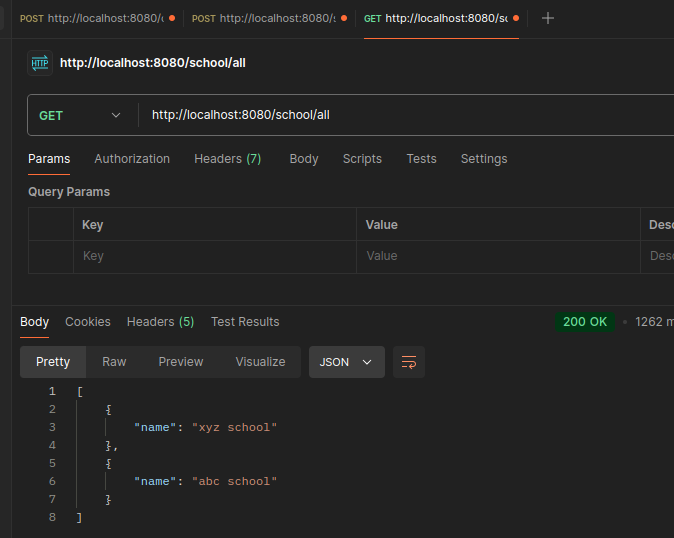

# Organising the code as per Dto

- create `SchoolMapper` `SchoolService`
- change and modify code in `SchoolController`, `SchoolMapper`, `SchoolService` as we have followed in in StudentDto

after rearranging check everything works:

for example:

            