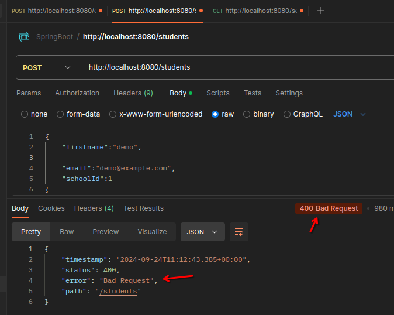
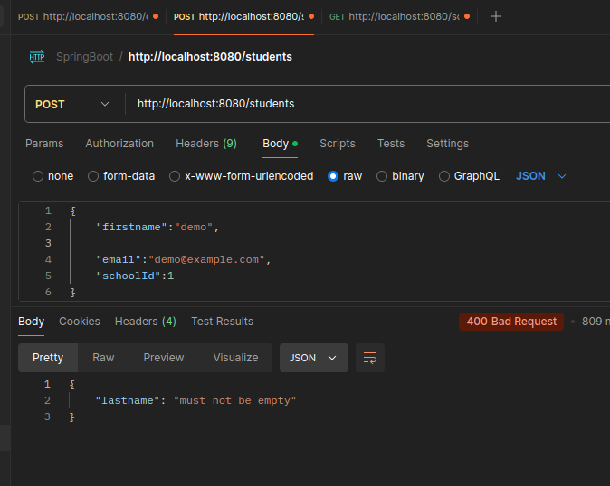
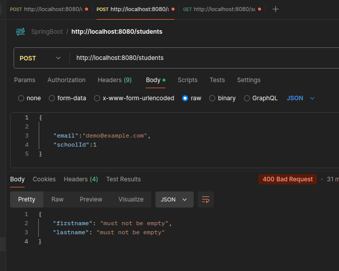
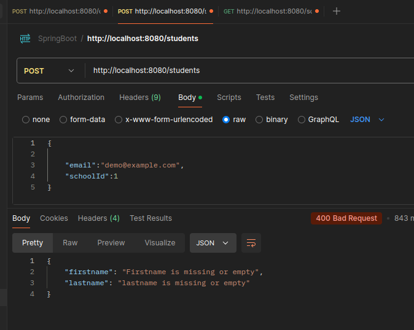

# Validation

- check pom.xml

in `StudentDto` make changes:

``` java
public record StudentDto(
        @NotEmpty
        String firstname,
        
        @NotEmpty
        String lastname, 
        String email,
        Integer schoolId) {

}
```

in `StudentController` add `@Valid` :

``` java
    @PostMapping("/students")
    public StudentResponseDto makePost( @Valid @RequestBody StudentDto studentdto){
        return  studentService.saveStudent(studentdto);
    }
```


### we have not entered lastname here:



**error in logs** looks like this:

```
2024-09-24T16:42:43.350+05:30  WARN 11466 --- [nio-8080-exec-1] .w.s.m.s.DefaultHandlerExceptionResolver : Resolved [org.springframework.web.bind.MethodArgumentNotValidException: Validation failed for argument [0] in public com.example.demo.student.StudentResponseDto com.example.demo.student.StudentController.makePost(com.example.demo.student.StudentDto): [Field error in object 'studentDto' on field 'lastname': rejected value [null]; codes [NotEmpty.studentDto.lastname,NotEmpty.lastname,NotEmpty.java.lang.String,NotEmpty]; arguments [org.springframework.context.support.DefaultMessageSourceResolvable: codes [studentDto.lastname,lastname]; arguments []; default message [lastname]]; default message [must not be empty]] ]
```

## Handling Exception

in `StudentController`, add this code:
``` java
    @ExceptionHandler(MethodArgumentNotValidException.class)
    public ResponseEntity<?> handleMethodArgumentNotValidException(
            MethodArgumentNotValidException exp){
        var errors =  new HashMap<String, String>();
        exp.getBindingResult().getAllErrors()
                .forEach(error -> {
                    var fieldName = ((FieldError)error).getField();
                    var errorMsg = error.getDefaultMessage();

                    errors.put(fieldName, errorMsg);
                });
        return new ResponseEntity<>(errors, HttpStatus.BAD_REQUEST);
    }
```

in postmant:


    


### Modifying the error messages

in `StudentDto`
``` java
public record StudentDto(
        @NotEmpty(message = "Firstname is missing or empty")
        String firstname,

        @NotEmpty(message = "lastname is missing or empty")
        String lastname,
        String email,
        Integer schoolId) {

}
```

error msg:




