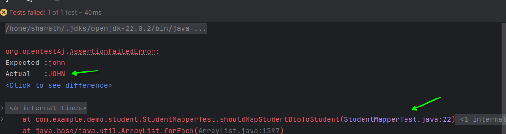

# Student mapper test

in `Student maper do this`
``` java
 public Student toStudent(StudentDto dto){
        var student = new Student();
        student.setFirstname(dto.firstname().toUpperCase());
 ```

run the test and output will be:



remove the code `.toUpperCase()` from the above snippet to work properly


