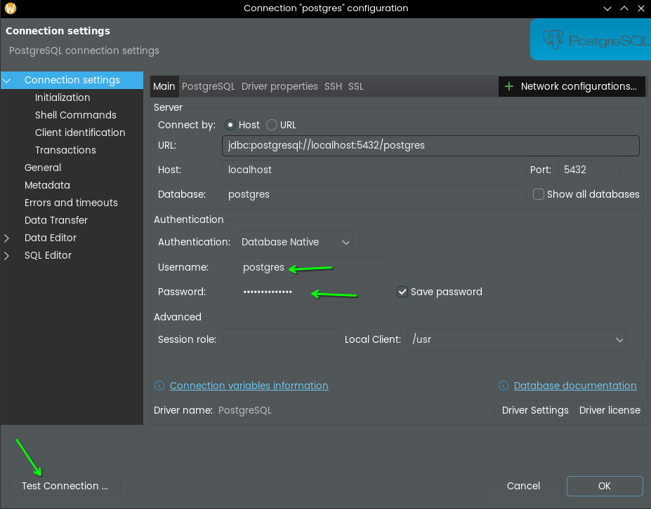

# setup Yaml 

also db setup done from docker

```
docker run -d -v /home/sharath/Documents/psql-project/data/pgdata:/var/lib/postgresql/data -e POSTGRES_USERNAME=postgres -e POSTGRES_PASSWORD=add_psswd -p 5432:5432 postgres
```

to start a connection: you gotta run the container (status of the container must be `running`)

## do this in dbeaver



- create `data_jpa` database
- make `public` as default schema (by right clicking)


