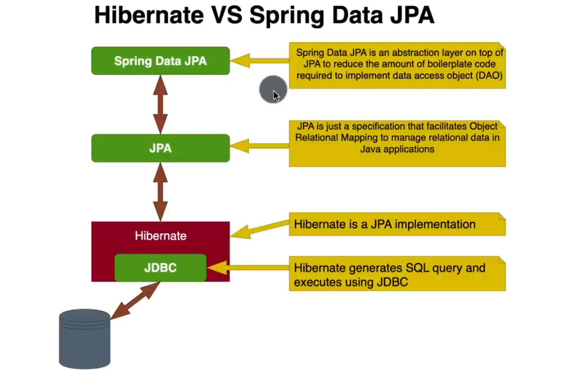

# ER diagram

### Difference between Hibernate vs spring Data JPA

### author.java

---

in `Author.java` 
- `@Data` Generates getters for all fields, a useful toString method

### GeneratedValue

### after adding Author.java

run the code, output will looks like this:

