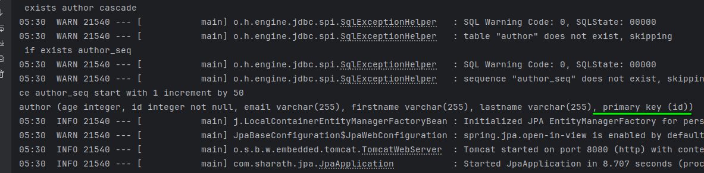

## ER diagram


### Difference between Hibernate vs spring Data JPA


### author.java


---

in `Author.java` 
- `@Data` Generates getters for all fields, a useful toString method

### GeneratedValue


### after adding Author.java

run the code, output will looks like this:




# Custom sequence Generator

in `Author.java`

``` java
public class Author {
    @Id
    @GeneratedValue(strategy = GenerationType.SEQUENCE,
    generator = "author_sequence")
    @SequenceGenerator(name = "author_sequence",
            sequenceName = "author_sequence",
            allocationSize = 1) // create sequence of author_sequence
    private Integer id; // we r not using int because , by default int = 0, Integer = null
    // ... more codes next line
```

### output:


