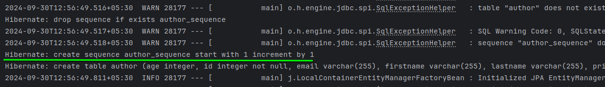

## ER diagram


### Difference between Hibernate vs spring Data JPA


### author.java


---

in `Author.java` 
- `@Data` Generates getters for all fields, a useful toString method

### GeneratedValue


### after adding Author.java

run the code, output will looks like this:


## Custom sequence Generator

in `Author.java`

``` java
public class Author {
    @Id
    @GeneratedValue(strategy = GenerationType.SEQUENCE,
    generator = "author_sequence")
    @SequenceGenerator(name = "author_sequence",
            sequenceName = "author_sequence",
            allocationSize = 1) // create sequence of author_sequence
    private Integer id; // we r not using int because , by default int = 0, Integer = null
    // ... more codes next line
```

### output:



## custom table

`Author.java`

``` java
public class Author {
    @Id
    @GeneratedValue(strategy = GenerationType.TABLE,
        generator = "author_id_gen")
    @TableGenerator(name = "author_id_gen",
        table = "id_generator",
        pkColumnName = "id_name",
        valueColumnName = "id_value",
        allocationSize = 1)
    private Integer id; // 
    // ... more
```

### output:


db content:


# adding Column constraint

``` java
@Data
@NoArgsConstructor
@Entity
public class Author {
    @Id
    @GeneratedValue
    private Integer id; // we r not using int because , by default int = 0, Integer = null

    @Column(name = "fname",
        length = 50)
    private String firstname;
    private String lastname;

    @Column(unique = true,
        nullable = false)
    private String email;
    private Integer age;

    @Column(updatable = false, nullable = false)
    private LocalDateTime createdAt;

    @Column(insertable = false)
    private LocalDateTime lastModified;
}
```

### output:

output log: 
```
.
.
.
2024-09-30T13:34:49.385+05:30  WARN 35873 --- [           main] o.h.engine.jdbc.spi.SqlExceptionHelper   : SQL Warning Code: 0, SQLState: 00000
2024-09-30T13:34:49.385+05:30  WARN 35873 --- [           main] o.h.engine.jdbc.spi.SqlExceptionHelper   : sequence "author_seq" does not exist, skipping
Hibernate: create sequence author_seq start with 1 increment by 50
Hibernate: create table author (age integer, id integer not null, created_at timestamp(6) not null, last_modified timestamp(6), fname varchar(50), email varchar(255) not null unique, lastname varchar(255), primary key (id))
2024-09-30T13:34:49.634+05:30  INFO 35873 --- [           main] j.LocalContainerEntityManagerFactoryBean : Initialized JPA EntityManagerFactory for persistence unit 'default'
.
.
.
```

from the above firstname is `fname`, and length is `(50)`

db view in UI


