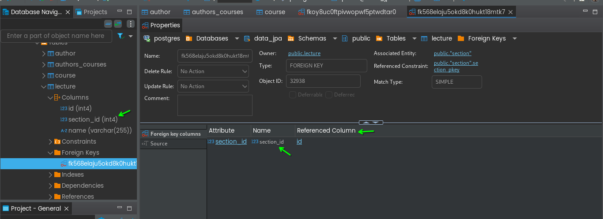
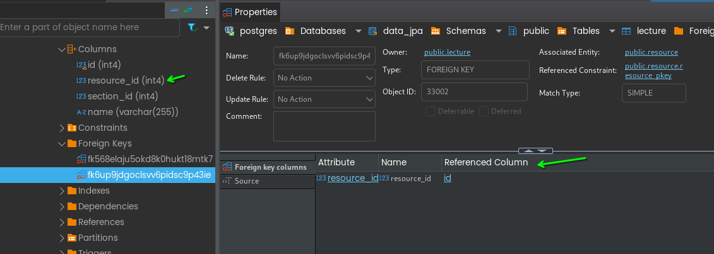
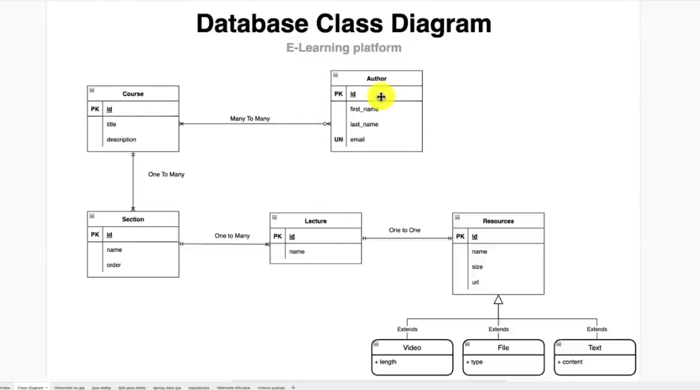

## Course and Section (one to Many)

- Course
- Section

section.java
``` java
    // some code here
    
    @JoinColumn(name = "course_id")
    private Course course;
```

### output:
``` 
...
2024-09-30T19:19:11.850+05:30  WARN 31205 --- [           main] o.h.engine.jdbc.spi.SqlExceptionHelper   : sequence "section_seq" does not exist, skipping
Hibernate: create sequence author_seq start with 1 increment by 50
Hibernate: create sequence course_seq start with 1 increment by 50
Hibernate: create sequence lecture_seq start with 1 increment by 50
Hibernate: create sequence resource_seq start with 1 increment by 50
Hibernate: create sequence section_seq start with 1 increment by 50
Hibernate: create table author (age integer not null, id integer not null, email varchar(255) not null unique, first_name varchar(255), last_name varchar(255), primary key (id))
Hibernate: create table authors_courses (authors_id integer not null, course_id integer not null)
Hibernate: create table course (id integer not null, description varchar(255), name varchar(255), primary key (id))
Hibernate: create table lecture (id integer not null, name varchar(255), primary key (id))
Hibernate: create table resource (id integer not null, size integer not null, name varchar(255), url varchar(255), primary key (id))
Hibernate: create table section (course_id integer, id integer not null, section_order integer, name varchar(255), primary key (id))
Hibernate: alter table if exists authors_courses add constraint FKrr4agwhyp5p9siiambkl0vbp5 foreign key (authors_id) references author
Hibernate: alter table if exists authors_courses add constraint FK3rul2ft7j0tugcncdsxuellui foreign key (course_id) references course
Hibernate: alter table if exists section add constraint FKoy8uc0ftpivwopwf5ptwdtar0 foreign key (course_id) references course
2024-09-30T19:19:12.892+05:30  INFO 31205 --- [           main] j.LocalContainerEntityManagerFactoryBean : Initialized JPA EntityManagerFactory for persistence unit 'default'
...
```


also in the course table, u will see below columns:
- id
- name
- section_order
- course_id

## Section to Lecture (One to many)

Section.java
``` java
    // some code
    @OneToMany(mappedBy = "section")
    private List<Lecture> lectures;
```


Lecture.java

``` java
    // some code
    
    @ManyToOne
    @JoinColumn(name = "section_id")
    private Section section;
```
### Output:



# Lecture to Resource (one to one)

### UniDirectional

Lecture.java

``` java
    // some code
    @OneToOne
    @JoinColumn(name = "resource_id")
    private Resource resource;
```



### to be bidirectional, do this:
@OneToOne
    @JoinColumn(name = "lecture_id")
    private Lecture lecture;
Resource.java

``` java
    // some code
    @OneToOne
    @JoinColumn(name = "lecture_id")
    private Lecture lecture;
```

check the database, like we did in previous (i dont wanna add screenshot)

## ER diagram will be same as show in the earlier course diagram




