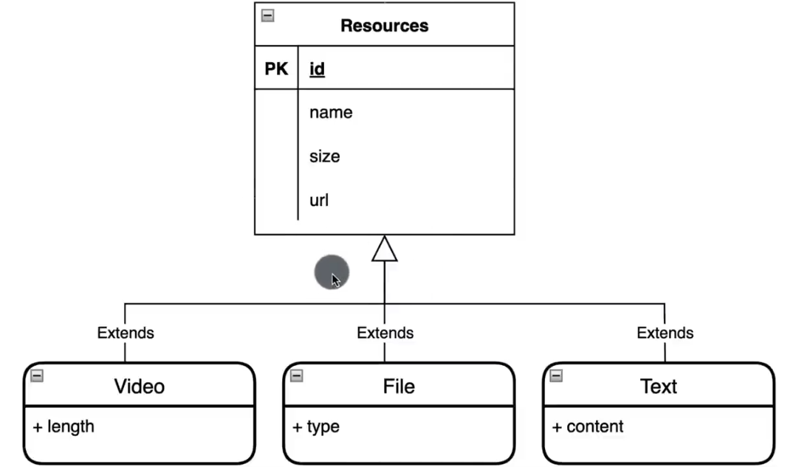
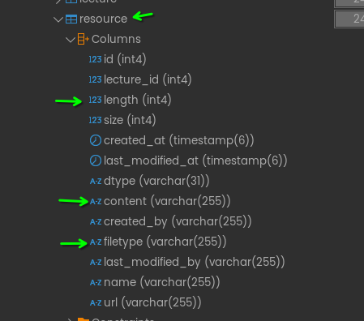
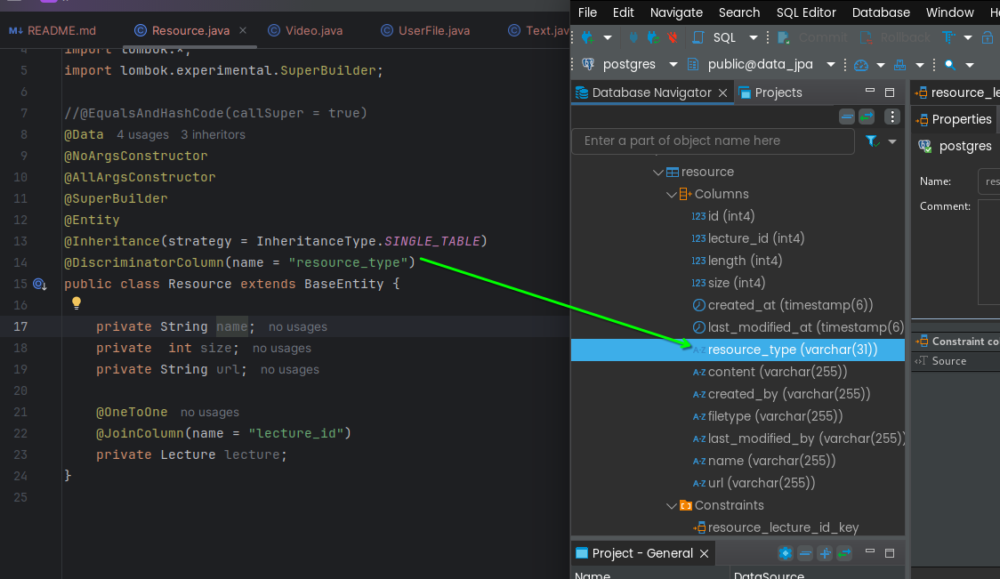
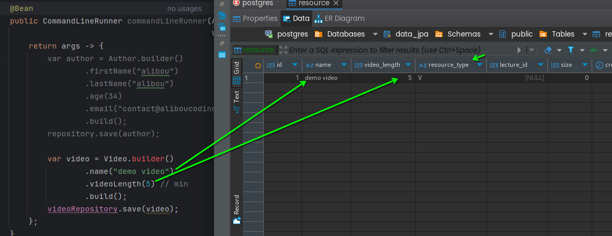

### length, filetype, content coming from Video, Userfile, Text

### adding resourceType
- Resource
- Text
- UserFile
- Video

### adding video data

from the below pic resource type **V** is coming from video class

