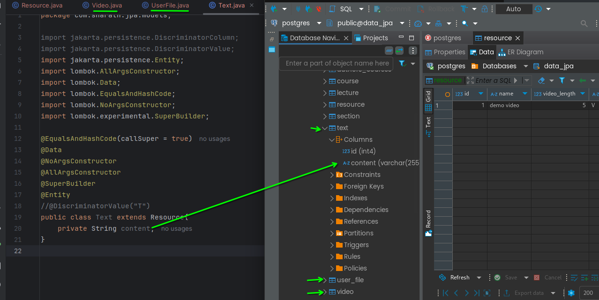
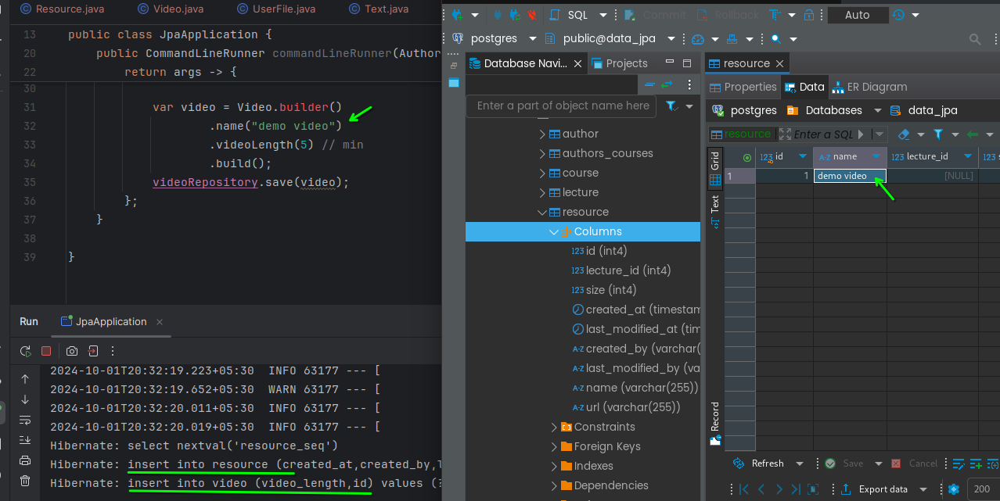
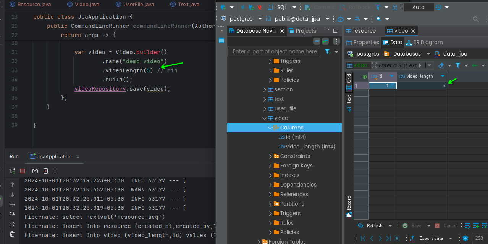

# Strategy Joined
- Resource
- Video
- UserFile
- Text



from the below file please notice the id in both tables





### below annotation will change the `id` to `video_id` in video table

Video.java

``` java
// some annotation
@PrimaryKeyJoinColumn(name = "video_id")
public class Video extends Resource {
    private Integer videoLength;

}
```