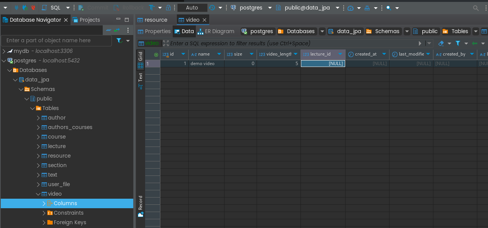

# Table per class Strategy

see changes in 
- Resource
- Video (comment)

from the below pic, its clear that it will create all the columns present in Resources + **the columns exist in Video Table**, also _Resource table will be empty here_       

check:
- JpaApplication

there will be `no data` in db `user_file`, `text`, but <ins>all the columns present in Resources</ins> + **the columns exist in respective Table**

