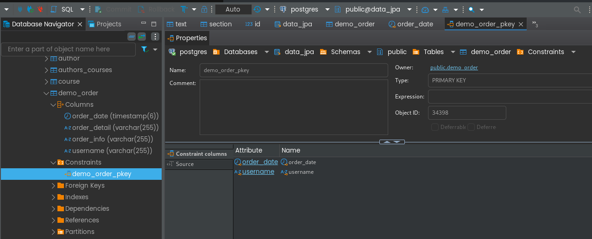
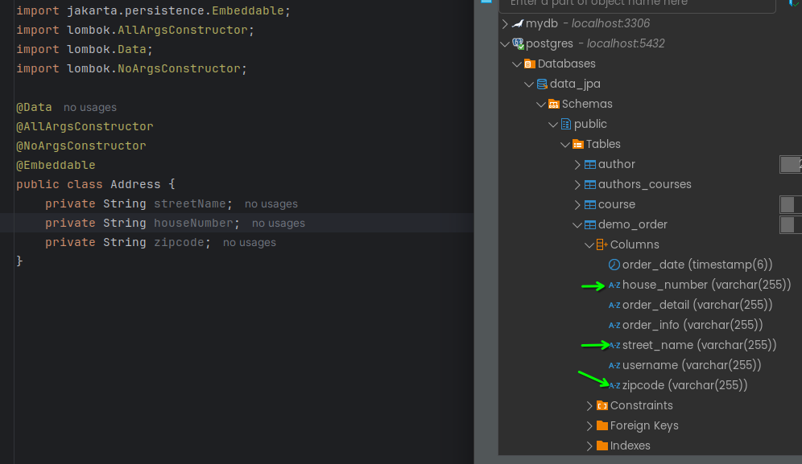

# Polymorphism

this should create only one table, **exclude all subclasses except this** (read the doc)

Video.java
``` java
// some annotaction
@Polymorphism(type = PolymorphismType.EXPLICIT) // default = PolymorphismType.IMPLICIT
public class Video extends Resource {
    private Integer videoLength;

}
``` 

# Embedded IDs

guessing two columns as primary key

changes to be made
- OrderId
- Order

the code in above classes will represent this in dbeaver.

to check click on order_demo table -> click on `columns` -> look and search for `DDL` and click on it

(the above one is located at properties -> column, constraint,... -> go down)
``` sql
CREATE TABLE public.demo_order (
	order_date timestamp(6) NOT NULL,
	order_detail varchar(255) NULL,
	order_info varchar(255) NULL,
	username varchar(255) NOT NULL,
	CONSTRAINT demo_order_pkey PRIMARY KEY (order_date, username)
);
```

or look here:



# Using Embedded annotation

~~adding columns to existing table~~ not sure

``` java
@Data
@AllArgsConstructor
@NoArgsConstructor
@Embeddable
public class Address {
    private String streetName;
    private String houseNumber;
    private String zipcode;
}
```

👇

``` java
// some code
@Table(name = "demo_order")
public class Order {
    @EmbeddedId
    private OrderId id;
    @Embedded
    private Address address;
    // some code
```

database:




