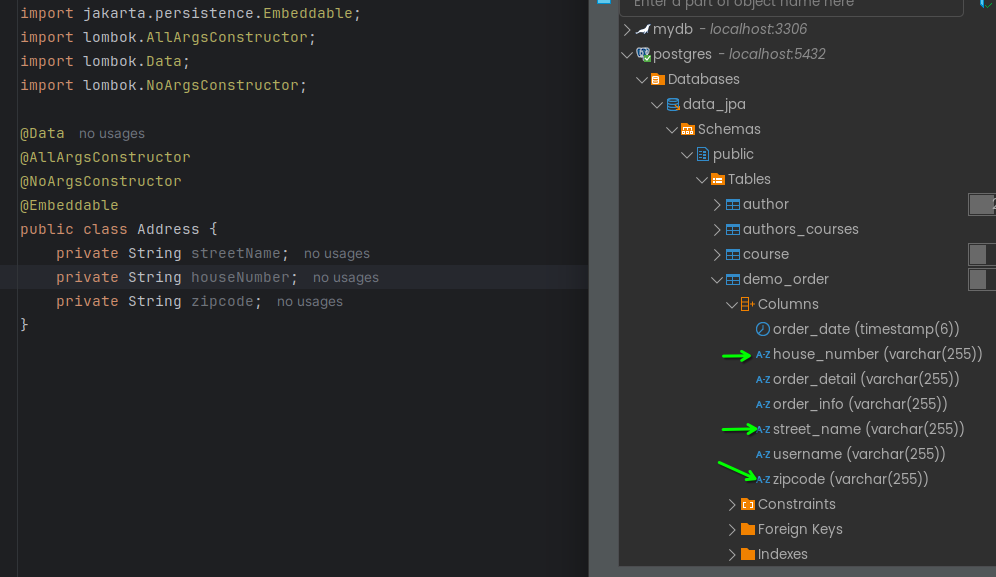
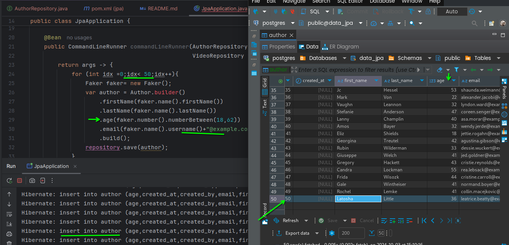
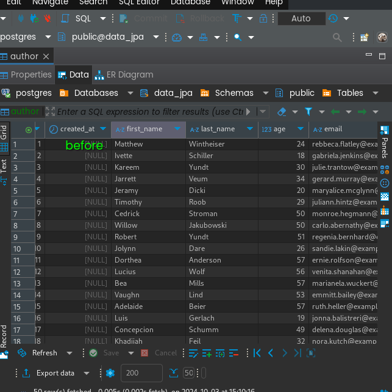
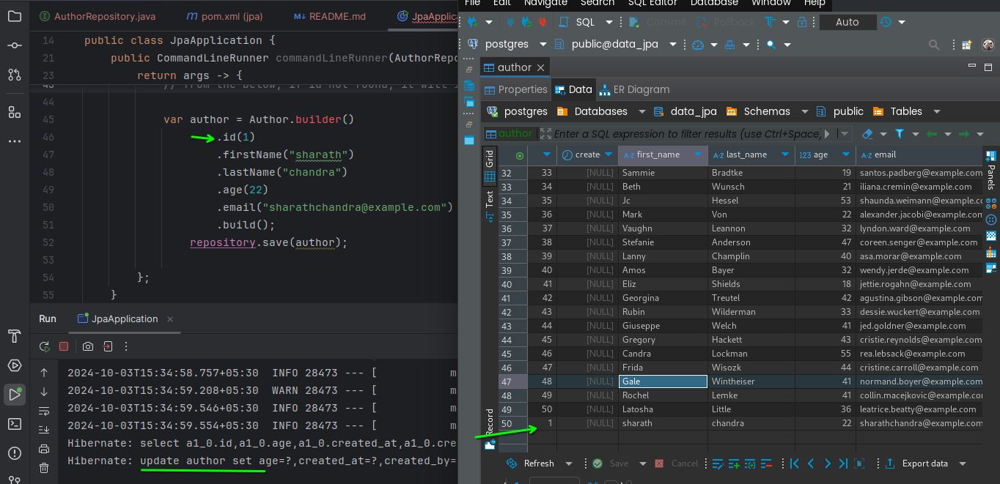
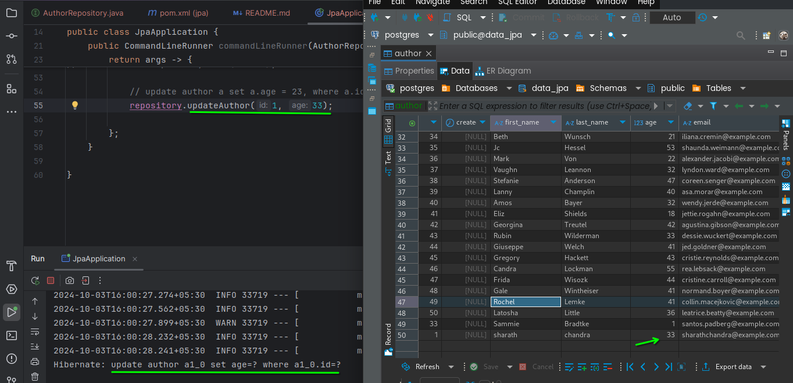
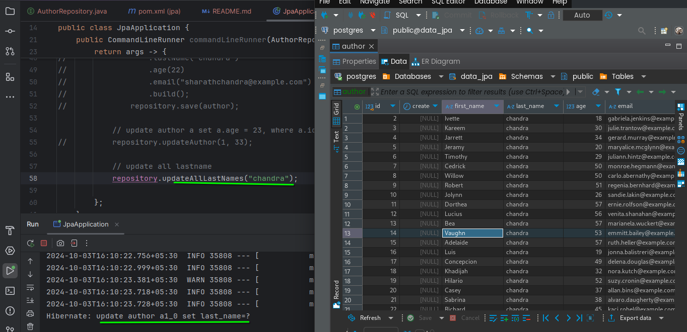

database:



---

- add java faker dependency in pom.xml
- modify jpaApplication.java

adding faker data to db



### home work:
need to test all the methods in AuthorRepository.java

# updating data





## updating selected columns

``` java
// some code
public interface AuthorRepository extends JpaRepository<Author, Integer> {

    //update author a set a.age = 33, where a.id = 1
    // author a => using alias
    @Modifying
    @Transactional
    @Query("update Author a set a.age = :age where a.id = :id")
    int updateAuthor(int id, int age);
    // some code
```
from the above code a.age belongs to class Author

 

## updating all lastnames

``` java
//some code
@Modifying
    @Transactional
    @Query("update Author a set a.lastName = :lastname")
    void updateAllLastNames(String lastname);
    // some code
```
from the above code a.lastName belongs to class Author




            